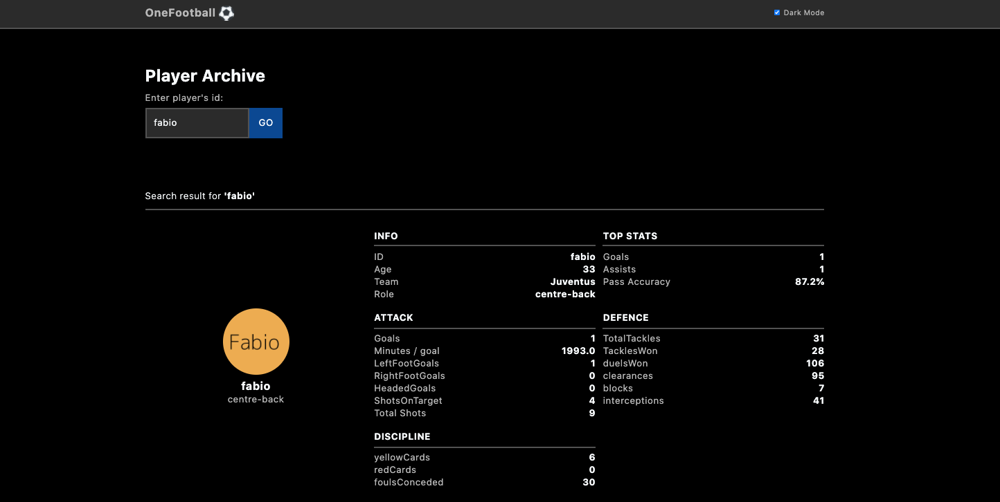

# Player Archive

[](https://app.netlify.com/sites/player-archive/deploys)

DEMO: [https://player-archive.netlify.app/](https://player-archive.netlify.app/)

A web application to search player archive and display the active player's profile.

By Searching these player's ids: `fabio`, `giorgio`, `francesco`.



## Technologies

This project was bootstrapped with [Create React App](https://github.com/facebook/create-react-app).

- React v17
- TailwindCSS v2
- Axios

## General architecture

The `<App>` component is wrapped up by `<Layout>` to setup a basic layout with `<Header>`, `<Footer>`. The page contain two major part `<SearchForm>` and `<PlayerProfile>`. And an async function to search player data from first data api `/data/<player-id>.json`.

When the `<SearchForm>` submit, it wil update the playerId to state in `<App>` component. And start fetching player data api to update player state. If the player is active, player's profile-id will pass into `<PlayerProfile>`, and fetching profile data api from `/profile/<profileid>.json`. `<PlayerProfile>` will render view to display the player's info, profile and stats.

## Gotchas

### Write a responsive and configurable ui

I'm using TailwindCSS for the project's styling. Refer to OneFootball's iOS player page for responsive design. And inspired by (onefootball.com)[https://onefootball.com/en], I made a similar layout page with dark mode. I Added serval customize color for dark/light theme in `tailwind.config.js`, to extending Tailwind CSS. Using toggle function with React Context to complete the Dark mode switcher.

### Add HTML `autofocus` attribute on the search field

Auto-focusing the search box when the page loaded, to improve user experience.

### Add Loading Indicator while fetching the profile API

Setup a loading state while fetching the PlayerProfile's API in `<PlayerProfile>` component.

### Add Searching state while fetching the player data API

Add `isSearching` state to when form submitting.

### Use CSS Grid in `<PlayerProfile>` component to display responsive layout

### What's next?

- Try to simplify HTML classes between React and Tailwind, can create more child component or using `@apply` to inline existing utility classes into my own custom CSS.
- Improve the error handling when fetching API.
- More testing!

## Project setup

To run this project, use the following commands in your terminal:

```
# clone the repository
git clone git@github.com:peterchencc/player-archive.git

# change the folder
cd player-archive

# install dependencies
npm install

# Runs the app in the development mode.
npm start

# Compiles and minifies for production
npm run build

# Run tests
npm test
```
